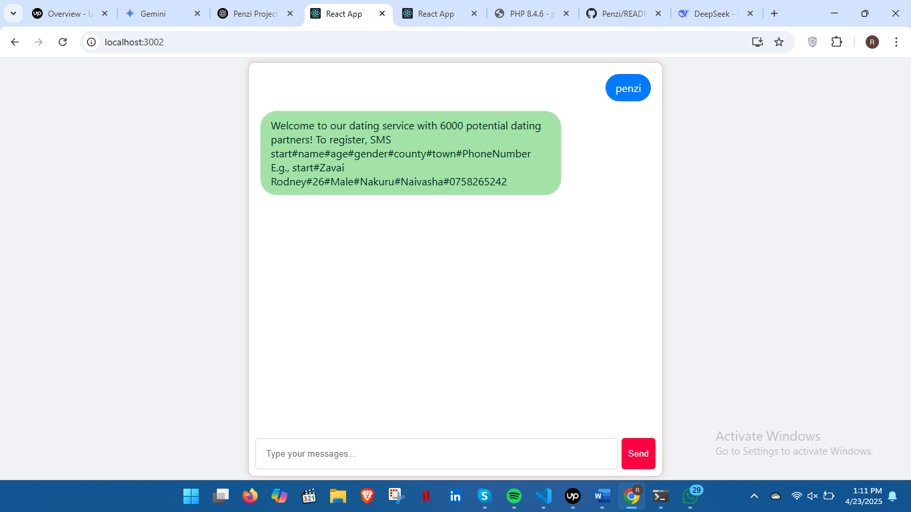
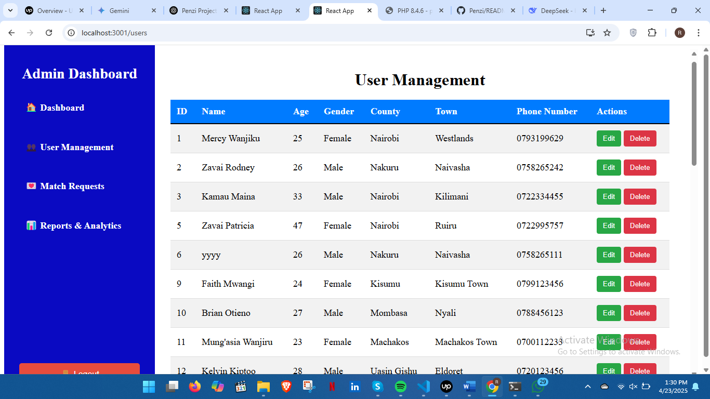
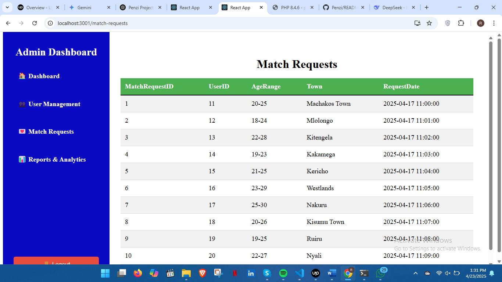
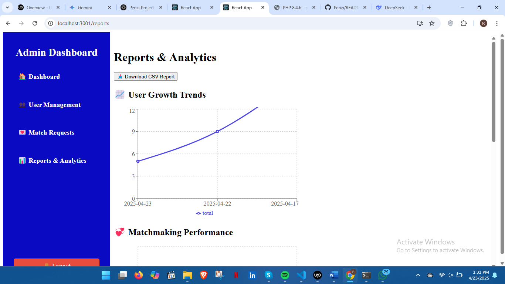

# PENZI

PENZI is a matching and dating system designed to facilitate structured, SMS-based communication between users and the system in order to match a user with a prospective partner. It features user and admin dashboards and a lightweight PHP backend integrated with a MySQL database.

## Features
- **Dashboard Interface**:
  ### 1️ Messaging UI  
Facilitates messages between the user and the system.

Here is how the UI looks like:  

 **How it works:**  
The user activates the bot by sending **"PENZI"**, then follows the instructions given by the system.
### 2️⃣ Admin Dashboard

The Admin Dashboard includes the following functionalities:

---

#### 🧑‍💼 User Management Page  
Here is how it looks:  

**How it works:**  
The admin can delete users from the system or edit user information using the buttons on the UI.

---

#### 💘 Match Requests Viewing  
Allows the admin to view all match requests made by users.  

Here is how the UI looks:  

---

####  Real-Time Reports and Analytics  
Shows user growth using graphs and highlights top locations where matches are made.  
Admins can also download an Excel document of all users.

Here is how the UI looks:  

## Technologies Used
- **Frontend**: React
- **Backend**: PHP (Vanilla)
- **Database**: MySQL
- **API**: PHP

## Setup Instructions
1. **Clone the Repository**:

   git clone https://github.com/zavai8547/Penzi

2. **Import the Database**:
Use a MySQL client like DBeaver to import the database:

3.  **Configure Database Credentials**:
In your db.php file, use the following credentials:
  MYSQL_HOST=database
MYSQL_USER=root
MYSQL_PASSWORD=rodney
MYSQL_DB=penzi
 
4. **Run the Application**
